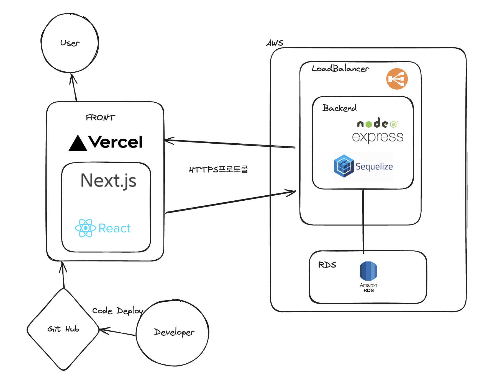

# 외주 프로젝트

## 씨네스투어

여행일정 관리와 패키지여행 구매까지

## 프로젝트 소개

### 기능

- 관리자가 표시해둔 패키지여행 구매기능

  
  

- 자신의 여행일정을 생성하고 구글 맵과 연동해서 일정관리하는 기능

  
  

### 일정

23.10 - 23.12

### 기술 스택

| 플랫폼    | 프레임워크 or 언어 |
| --------- | ------------------ |
| Web App   | Next13             |
| Web Admin | Vite               |
| Backend   | Nodejs             |
| IOS       | Swift              |
| Android   | Kotlin             |

**상세스택**

```jsx
**[ Backend ]** Nodejs
- "axios": "^1.5.1",
- "bcrypt": "^5.0.1",
- "config": "^3.3.9",
- "dotenv": "^16.1.4",
- "express": "^4.17.1",
- "multer": "^1.4.5-lts.1",
- "mysql2": "^2.2.5",
- "passport": "^0.5.0",
- "sequelize": "^6.6.2",

**[ Frontend ]** Next13
- "@mui/material": "^5.14.6",
- "@tanstack/react-query": "^5.13.4",
- "axios": "^1.5.0",
- "moment": "^2.29.4",
- "next": "13.4.19",
- "react": "18.2.0",
- "swr": "^2.2.4",

**[ DB ]**
- MySQL `8.0.30`

**[ DevOps ]**
- Docker
- Vercel
- AWS EC2, LB

**[ Storage ]**
- S3 Bucket

**[ IDE ]**
- Nvim
- VSCode

**[ Team Collaboration Tool ]
- Notion
- Git
```

### 프로젝트 구조



### 프로젝트 기록
